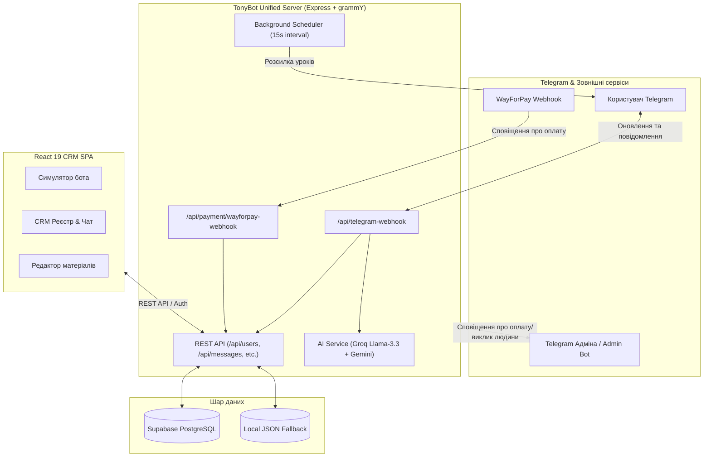
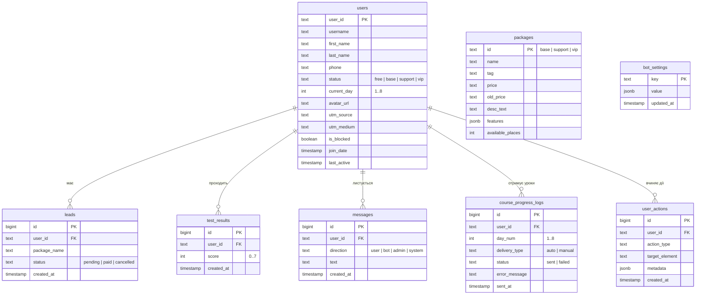

# 🌟 TonyBot Unified Platform — Онлайн-практикум «Точка переходу»
## Повний опис можливостей платформи та призначення кожного файлу проєкту

> **Репозиторій:** [AlexNumo/tony-bot-unified](https://github.com/AlexNumo/tony-bot-unified)  
> **Призначення:** Консолідована екосистема для онлайн-практикуму Антоніни Пашко «Точка переходу», що об'єднує Telegram-бота (`grammY`), веб-сервер (`Express`), панель адміністратора/CRM (`React 19`), базу даних (`Supabase PostgreSQL`) та платіжний шлюз (`WayForPay`).

---

## 📑 Зміст

1. [Архітектурна концепція](#1-архітектурна-концепція)
2. [Головні можливості та функціонал платформи](#2-головні-можливості-та-функціонал-платформи)
   - [2.1. Telegram-бот (Клієнтська частина)](#21-telegram-бот-клієнтська-частина)
   - [2.2. ШІ-асистент (Groq + Gemini)](#22-ші-асистент-groq--gemini)
   - [2.3. Платіжна інтеграція (WayForPay)](#23-платіжна-інтеграція-wayforpay)
   - [2.4. Автоматичний планувальник уроків (Scheduler)](#24-автоматичний-планувальник-уроків-scheduler)
   - [2.5. База даних та збереження даних (Supabase + Local Fallback)](#25-база-даних-та-збереження-даних-supabase--local-fallback)
   - [2.6. CRM Адмін-панель та Симулятор (React 19)](#26-crm-адмін-панель-та-симулятор-react-19)
3. [Детальний опис кожного файлу проєкту](#3-детальний-опис-кожного-файлу-проєкту)
   - [3.1. Кореневі файли конфігурації та сервера](#31-кореневі-файли-конфігурації-та-сервера)
   - [3.2. Telegram-бот (`src/bot/`)](#32-telegram-бот-srcbot)
   - [3.3. Сервісний шар (`src/services/`)](#33-сервісний-шар-srcservices)
   - [3.4. Дані та конфігурація (`src/data/`)](#34-дані-та-конфігурація-srcdata)
   - [3.5. Фронтенд-компоненти CRM та адмінки (`src/components/` & `src/`)](#35-фронтенд-компоненти-crm-та-адмінки-srccomponents--src)
   - [3.6. Службові скрипти та утиліти](#36-службові-скрипти-та-утиліти)
4. [Схема бази даних (Таблиці Supabase)](#4-схема-бази-даних-таблиці-supabase)
5. [Таблиця змінних оточення (`.env`)](#5-таблиця-змінних-оточення-env)

---

## 1. Архітектурна концепція

Історично подібні рішення складалися з двох окремих систем: окремого Python/Node бота та окремого веб-сервісу адмінки. Це призводило до подвійних витрат на хостинг ($14/міс замість $7/міс) та конфліктів Telegram Polling (помилка `409 Conflict`).

**TonyBot Unified** консолідує все в єдиний монолітний, але модульний сервіс:
- **Express 4 HTTP Server**: обслуговує REST API, вебхуки Telegram та WayForPay, а також роздає зібраний React SPA.
- **grammY Engine**: працює через **Webhook** у продакшні на Render (`/api/telegram-webhook`) та автоматично перемикається на **Long Polling** при локальній розробці (`NODE_ENV !== 'production'` або відсутній `WEBHOOK_URL`).
- **Single Source of Truth**: Supabase (PostgreSQL) зберігає весь стан (користувачі, ліди, повідомлення, результати тестів, розклад розсилок). При відсутності підключення система прозоро використовує локальні JSON-файли як fallback.

---

## 2. Головні можливості та функціонал платформи

### 2.1. Telegram-бот (Клієнтська частина)
- **Головне меню та навігація:** Інформація про практикум, деталі програми за всіма 8 днями, регалії авторки, вибір та замовлення тарифів, контакти.
- **Діагностичний тест (7 ознак):** FSM-тест (State Machine у пам'яті), де користувачка відповідає «Так/Ні» на 7 психологічних маркерів. За результатами видається розгорнута інтерпретація та рекомендація практикуму, а бал зберігається в базі.
- **Захист авторського контенту (`protect_content: true`):** Відео-уроки, аудіо-медитації та презентації надсилаються із забороною пересилання, копіювання та збереження.
- **Видача робочих зошитів та бонусів:** Одразу після оплати користувач отримує привітання, 2 версії PDF Робочого зошита та 3 цінні бонуси з комфортним 15-секундним інтервалом (зошити надсилаються без захисту, щоб їх можна було надрукувати).
- **Команди уроків `/day1` – `/day8`:** Доступні лише учасницям із платним статусом (`base`, `support`, `vip`). Для безкоштовних користувачів видається пропозиція обрати тариф.
- **Глибокі посилання (Deep Linking):**
  - `/start pay_base`, `/start pay_support`, `/start pay_vip` — миттєва активація доступу після повернення зі сторінки оплати.
  - `/start utm_source_medium` — автоматичний запис маркетингових міток у картку ліда.
- **Отримання та прив'язка номера телефону (`:contact`):** Запит кнопки «Поділитися контактом» для автоматичної звірки оплат із сайту.
- **Службова команда `#upload`:** Спеціальний режим для адміна прямо в Telegram — надсилання медіа з підписом `#upload [day_X] [type]` миттєво зберігає Telegram `file_id` у базу занять.

### 2.2. ШІ-асистент (Groq + Gemini)
- **Персоналізація від імені Антоніни Пашко:** Глибокий психологічний системний промпт українською мовою. Тон теплий, емпатичний, без надриву та повчань.
- **Мультимодельний каскадний Fallback:**
  - 1-й пріоритет: Надшвидкісний безкоштовний **Groq** (`llama-3.3-70b-versatile`, `llama-3.1-70b`, `llama-3.1-8b`, `mixtral-8x7b`).
  - 2-й пріоритет: **Google Gemini** (`gemini-1.5-flash`, `gemini-2.0-flash`, `gemini-pro`).
  - 3-й пріоритет: Елегантна відповідь про передачу повідомлення Антоніні з тегом ескалації.
- **Денний ліміт:** 15 запитів/день на користувачку для захисту від перевантаження та зловживань.
- **Автоматична детекція потреби в людині (Escalation):**
  - За ключовими словами («людина», «менеджер», «підтримка», «жива», «подзвонити», «Антоніна» тощо).
  - За спеціальним тегом від ШІ `[CALL_HUMAN]`.
  - Миттєва відправка екстреного сповіщення двом адмінам через основний бот та службовий Admin Bot.

### 2.3. Платіжна інтеграція (WayForPay)
- **Повна обробка Webhook (`/api/payment/wayforpay-webhook`):** Перевірка підпису MD5 HMAC та формування стандартної відповіді `accept`.
- **Автоматична активація статусу:** Визначення тарифу (`base`, `support`, `vip`) за сумою або `orderReference`.
- **Зв'язка з гостьовими оплатами:** Якщо людина оплатила на сайті за номером телефону ще до того, як відкрила Telegram-бота, створюється запис гостя (`guest_phone`). Коли вона запускає бота та ділиться контактом, бот знаходить оплату, активує повний доступ і одразу надсилає зошити та 1-й урок.

### 2.4. Автоматичний планувальник уроків (Scheduler)
- **Фоновий таймер (кожні 15 секунд):** Перевіряє поточний час за Києвом (`Europe/Kyiv`).
- **Щоденна доставка:** О заданій годині (за замовчуванням 17:00) всім активним платним учасницям надсилається матеріал їхнього поточного дня, після чого номер дня автоматично збільшується (`current_day + 1`).
- **Захист від лімітів Telegram:** Затримка між повідомленнями для запобігання помилкам `429 Too Many Requests`.
- **Збереження конфігурації:** Час розсилки та цільова аудиторія можуть динамічно змінюватися з адмінки та зберігаються в таблиці `bot_settings` або JSON.

### 2.5. База даних та збереження даних (Supabase + Local Fallback)
- **Supabase (PostgreSQL):** Повний набір таблиць із зовнішніми ключами та каскадним видаленням.
- **Local Fallback:** Якщо змінні `SUPABASE_URL` чи `SUPABASE_SECRET_KEY` не налаштовані, система безшовно перемикається на локальні JSON-файли в папці `src/data/`, гарантуючи безперебійну роботу в режимі розробки.
- **Автоматичне очищення історії:** Регулярне видалення старих повідомлень (старше 7 днів) для зменшення обсягу бази.

### 2.6. CRM Адмін-панель та Симулятор (React 19)
- **Безпечна авторизація:** Вхід за Email та паролем з генерацією підписаного токена (HMAC SHA-256) на 30 днів.
- **Вкладка «Симулятор бота»:** Повний інтерактивний симулятор інтерфейсу Telegram з підтримкою відтворення аудіо, перегляду кнопок меню, перемикання користувачів та режиму реального часу.
- **Вкладка «Панель CRM & База»:**
  - Таблиця всіх користувачів з аватарами, контактами, статусами та поточним днем.
  - Можливість ручної зміни тарифу та ручного надсилання будь-якого уроку (1-8).
  - Вбудований живий чат: адмін може писати користувачу прямо з адмінки в Telegram.
  - Налаштування розкладу розсилки (година, хвилини) та журнал доставки.
  - Візуальна аналітика: графіки розподілу тарифів (PieChart) та результатів тесту (BarChart).
- **Вкладка «Програма (8 днів)»:** Інтерактивний редактор назв, описів, тривалості та `file_id` для кожного дня практикуму з миттєвою синхронізацією на сервері.

---

## 3. Детальний опис кожного файлу проєкту

### 3.1. Кореневі файли конфігурації та сервера

| Файл | Призначення та зона відповідальності |
| :--- | :--- |
| [`server.ts`](file:///c:/Futures/Antonina/server.ts) | **Головна точка входу бекенду.** Створює Express-додаток, ініціалізує Telegram-бота (`createBot()`), налаштовує Webhook або Polling, реалізує REST API для адмінки (користувачі, ліди, чат, налаштування розсилки), обробляє Webhook WayForPay, роздає статичні файли React-додатка з `dist/` та запускає фоновий планувальник розсилок. |
| [`package.json`](file:///c:/Futures/Antonina/package.json) | Маніфест проекту: описує метадані, скрипти збірки (`dev`, `build`, `build:client`, `build:server`, `start`) та всі NPM-залежності (`grammy`, `express`, `@supabase/supabase-js`, `groq-sdk`, `@google/generative-ai`, `react`, `motion`, `recharts` тощо). |
| [`schema.sql`](file:///c:/Futures/Antonina/schema.sql) | **SQL-схема для Supabase PostgreSQL.** Містить DDL для створення 8 таблиць (`users`, `packages`, `leads`, `test_results`, `messages`, `course_progress_logs`, `user_actions`, `bot_settings`) з індексами, зв'язками, дефолтними значеннями та початковими даними тарифів. |
| [`render.yaml`](file:///c:/Futures/Antonina/render.yaml) | **Infrastructure as Code (IaC) для Render.** Описує конфігурацію веб-сервісу Node.js на тарифі Starter, команди білду (`npm install && npm run build`) та запуску (`npm start`), а також необхідні змінні оточення. |
| [`vite.config.ts`](file:///c:/Futures/Antonina/vite.config.ts) | Конфігурація Vite 6 для швидкої збірки клієнтського React 19 SPA з підтримкою Tailwind CSS v4 та React-плагіна. |
| [`tsconfig.json`](file:///c:/Futures/Antonina/tsconfig.json) | Налаштування компілятора TypeScript (ESNext, React-JSX, строга типізація, Node resolution). |
| [`.env.example`](file:///c:/Futures/Antonina/.env.example) | Шаблон змінних середовища для розгортання та локальної розробки з описом кожного ключа. |
| [`index.html`](file:///c:/Futures/Antonina/index.html) | HTML-контейнер для фронтенду адмін-панелі: підключає шрифти Google Fonts (Plus Jakarta Sans, Syne), фавікон та точку монтування `#root`. |

---

### 3.2. Telegram-бот (`src/bot/`)

| Файл | Призначення та зона відповідальності |
| :--- | :--- |
| [`src/bot/bot.ts`](file:///c:/Futures/Antonina/src/bot/bot.ts) | **Ініціалізація та маршрутизація Telegram-бота.** Створює екземпляр `Bot<Context>`, реєструє глобальний обробник помилок `bot.catch`, підключає обробники команд (`/start`, `/help`, `/day1`–`/day8`), подій контактів, callback-кнопок, медіа-завантаження `#upload` та ШІ-текстових повідомлень. |
| [`src/bot/keyboards.ts`](file:///c:/Futures/Antonina/src/bot/keyboards.ts) | **Фабрика клавіатур бота.** Генерує всі меню та кнопки: звичайну клавіатуру надсилання контакту, головне інлайн-меню, меню програми 8 днів, клавіатуру вибору тарифів (із кнопкою WebApp сайту), кнопки переходу на оплату WayForPay, інлайн-кнопки опитування 7 ознак та блок контактів. |
| [`src/bot/materials.ts`](file:///c:/Futures/Antonina/src/bot/materials.ts) | **Видача навчальних зошитів та подарунків після оплати.** Містить постійні Telegram `file_id` для 2 варіантів Робочого зошита та 3 бонусів (презентації + медитація). Функція `sendPurchaseMaterialsToUser` надсилає матеріали послідовно із затримками у 15 секунд (без блокування контенту для можливості друку). |
| [`src/bot/handlers/start.ts`](file:///c:/Futures/Antonina/src/bot/handlers/start.ts) | **Обробник команди `/start`.** Парсить Deep Links (`pay_*`, `utm_*`), отримує аватарку користувача через Telegram API, реєструє користувача в Supabase, перевіряє наявність збереженого телефону, перевіряє статус підписки (якщо оплачено — вітає та видає поточний урок) або надсилає вітальне повідомлення для нових користувачів. |
| [`src/bot/handlers/callbacks.ts`](file:///c:/Futures/Antonina/src/bot/handlers/callbacks.ts) | **Обробник інлайн-кнопок.** Відповідає за переходи між розділами меню: «Про практикум», «Про авторку», «Програма», вибір окремого дня, перегляд тарифів, перехід до оплати пакетів (`order_base`, `order_support`, `order_vip`), виклик повторної відправки зошитів (`my_workbooks`) та сповіщення адмінів про замовлення. |
| [`src/bot/handlers/test.ts`](file:///c:/Futures/Antonina/src/bot/handlers/test.ts) | **Діагностичний тест (7 запитань).** Реалізує покроковий FSM-діалог опитування про синдром самозванця та перевантаження. Зберігає проміжний стан користувача в пам'яті, підраховує бали, записує результат у таблицю `test_results` та видає персоналізований вердикт. |
| [`src/bot/handlers/day.ts`](file:///c:/Futures/Antonina/src/bot/handlers/day.ts) | **Доставка уроків (`/day1` – `/day8`).** Перевіряє оплачений статус користувача. Функція `sendDayMaterial` формує структуроване повідомлення з описом уроку, надсилає відео-урок, аудіо-практику, фото та презентацію (з увімкненим `protect_content: true`). |
| [`src/bot/handlers/contact.ts`](file:///c:/Futures/Antonina/src/bot/handlers/contact.ts) | **Обробник надсилання номера телефону.** Зберігає номер телефону користувача в базу, викликає `checkAndLinkGuestPayment` для перевірки, чи була оплата на сайті за цим номером до запуску бота, і якщо так — автоматично активує тариф та видає матеріали. |
| [`src/bot/handlers/upload.ts`](file:///c:/Futures/Antonina/src/bot/handlers/upload.ts) | **Службовий модуль адміна `#upload`.** Дозволяє адміністратору надсилати в бот файли з підписом на кшталт `#upload [day_1] [video]` або `#upload [welcome] [photo]`. Бот перехоплює `file_id` і автоматично оновлює конфігурацію `lessons.json`. |
| [`src/bot/handlers/aiText.ts`](file:///c:/Futures/Antonina/src/bot/handlers/aiText.ts) | **ШІ-діалог та ескалація на людину.** Обробляє довільний текст користувача: перевіряє ліміт (15 повідомлень/день), аналізує текст на ключові слова виклику людини, звертається до `generateAiResponse`, перевіряє тег `[CALL_HUMAN]` та у разі потреби надсилає миттєве сповіщення обом адмінам. |

---

### 3.3. Сервісний шар (`src/services/`)

| Файл | Призначення та зона відповідальності |
| :--- | :--- |
| [`src/services/supabase.ts`](file:///c:/Futures/Antonina/src/services/supabase.ts) | **Центральний шар доступу до даних.** Містить клієнт `SupabaseClient` та повний набір функцій: робота з користувачами (`addUser`, `getUserData`, `updateUserStatus`, `updateUserDay`, `updateUserPhone`, `getAllUsers`, `getUsersByStatus`), лідами (`saveLead`, `getAllLeads`), результатами тестів (`saveTestResult`, `getAllTestResults`), повідомленнями (`saveMessage`, `getUserMessages`, `cleanupOldMessages`), логами прогресу, прив'язкою гостьових оплат (`checkAndLinkGuestPayment`) та конфігурацією планувальника. Має вбудований прозорий fallback на JSON-файли. |
| [`src/services/ai.ts`](file:///c:/Futures/Antonina/src/services/ai.ts) | **Інтеграція зі штучним інтелектом.** Формує системний промпт від імені Антоніни Пашко з повною базою знань про практикум. Керує запитами до Groq (Llama-3.3/3.1) та Google Gemini з автоматичним перебором робочих моделей та контекстом останніх повідомлень. |
| [`src/services/adminNotifier.ts`](file:///c:/Futures/Antonina/src/services/adminNotifier.ts) | **Система екстрених сповіщень адміністраторів.** Надсилає повідомлення про нові замовлення, оплати та виклики живого фахівця: через основний бот головному адміну (`notifyAdminAboutMessage`) та через окремий Admin Bot обом адміністраторам (`sendAdminBotNotification`). |
| [`src/services/scheduler.ts`](file:///c:/Futures/Antonina/src/services/scheduler.ts) | **Планувальник автоматичних розсилок.** Запускає 15-секундний інтервал для перевірки часу за Києвом (`startBackgroundScheduler`), виконує щоденну розсилку наступного уроку всім платним учасницям (`runNewsletterBroadcast`), веде лог розсилок та запускає очищення старих повідомлень. |
| [`src/services/sheets.ts`](file:///c:/Futures/Antonina/src/services/sheets.ts) | **Інтеграція з Google Таблицями.** Відправляє події, оплати або ліди на зовнішній Webhook Google Apps Script (якщо налаштований `GOOGLE_SHEET_WEBHOOK_URL`). |

---

### 3.4. Дані та конфігурація (`src/data/`)

| Файл | Призначення та зона відповідальності |
| :--- | :--- |
| [`src/data/lessonsData.ts`](file:///c:/Futures/Antonina/src/data/lessonsData.ts) | **Еталонні дані занять (Дні 1–8).** Містить початкові описи, назви практик, тривалість, назви PDF/аудіо та актуальні Telegram `file_id` для всіх медіафайлів курсу. |
| [`src/data/lessons.json`](file:///c:/Futures/Antonina/src/data/lessons.json) | **Динамічний кеш уроків.** Файл, який оновлюється адміном з веб-інтерфейсу або через команду `#upload` у Telegram. Дозволяє змінювати контент без перезапуску сервера. |
| [`src/data/scheduler_config.json`](file:///c:/Futures/Antonina/src/data/scheduler_config.json) | **Локальна конфігурація розкладу.** Зберігає годину та хвилини розсилки, цільову аудиторію та дату останньої виконаної автоматичної розсилки. |
| [`src/data/codeSnippets.ts`](file:///c:/Futures/Antonina/src/data/codeSnippets.ts) | **Зразки коду для компонента CodeExplorer.** Використовуються для демонстрації ключових частин архітектури в адмін-панелі. |

---

### 3.5. Фронтенд-компоненти CRM та адмінки (`src/components/` & `src/`)

| Файл | Призначення та зона відповідальності |
| :--- | :--- |
| [`src/App.tsx`](file:///c:/Futures/Antonina/src/App.tsx) | **Головний контейнер React-додатка.** Керує станом авторизації (перевірка токена), перемиканням вкладок («Симулятор», «CRM & База», «Програма»), глобальними сповіщеннями (Toast), виходом із системи та передачею даних між підкомпонентами. |
| [`src/main.tsx`](file:///c:/Futures/Antonina/src/main.tsx) | Точка входу клієнтського застосунку React: монтує `App` у DOM елемент `#root`. |
| [`src/index.css`](file:///c:/Futures/Antonina/src/index.css) | Глобальні стилі додатку, налаштування Tailwind CSS v4 та кольорової палітри темної теми. |
| [`src/types.ts`](file:///c:/Futures/Antonina/src/types.ts) | **Спільні інтерфейси TypeScript.** Описує моделі: `User`, `ChatMessage`, `Lesson`, `Lead`, `TestResult`, `BroadcastLog`, `SchedulerConfig`, `Package`, `UserStatus`. |
| [`src/components/LoginPage.tsx`](file:///c:/Futures/Antonina/src/components/LoginPage.tsx) | **Сторінка авторизації.** Форма введення Email та пароля з валідацією, показом/приховуванням пароля та збереженням JWT токена в `localStorage`. |
| [`src/components/CRMDashboard.tsx`](file:///c:/Futures/Antonina/src/components/CRMDashboard.tsx) | **Основна панель управління CRM.** Реєстр підписників із фільтрацією та пошуком, перемикач тарифів, кнопка ручної відправки уроків, двосторонній чат з користувачем Telegram, налаштування розкладу розсилок, системні логи та графіки аналітики (Recharts). |
| [`src/components/TelegramSimulator.tsx`](file:///c:/Futures/Antonina/src/components/TelegramSimulator.tsx) | **Інтерактивний емулятор Telegram.** Дозволяє тестувати взаємодію з ботом, натискати кнопки меню, проходити опитування, симулювати оплату, слухати аудіо-практики та переглядати діалоги реальних користувачів. |
| [`src/components/CourseMaterials.tsx`](file:///c:/Futures/Antonina/src/components/CourseMaterials.tsx) | **Редактор контенту практикуму.** Відображає всі 8 днів, дає змогу редагувати тексти, описи, час уроків та зберігати їх на сервер через API. |
| [`src/components/CodeExplorer.tsx`](file:///c:/Futures/Antonina/src/components/CodeExplorer.tsx) | **Інтерактивний довідник архітектури.** Дозволяє переглядати ключові файли бекенду та копіювати вихідний код. |

---

### 3.6. Службові скрипти та утиліти

| Файл | Призначення та зона відповідальності |
| :--- | :--- |
| `patch_all.cjs` | Службовий скрипт міграції: використовувався для виправлення імпортів, логіки очищення старих повідомлень у `supabase.ts` та інтерфейсу в `CRMDashboard.tsx`. |
| `patch_sch.cjs` | Службовий скрипт: налаштування асинхронного читання конфігурації планувальника в `scheduler.ts`. |
| `patch_server2.cjs` | Службовий скрипт: оптимізація роутів конфігурації розсилки в `server.ts`. |

---

## 4. Схема бази даних (Таблиці Supabase)

---

## 5. Таблиця змінних оточення (`.env`)

| Змінна | Обов'язкова | Призначення | Приклад значення |
| :--- | :---: | :--- | :--- |
| `TELEGRAM_BOT_TOKEN` | **Так** | Токен основного Telegram-бота від `@BotFather` | `7123456789:AA...` |
| `ADMIN_BOT_TOKEN` | Ні | Токен додаткового бота для сповіщень адміністраторів | `8923506126:AAE4...` |
| `ADMIN_TELEGRAM_ID` | **Так** | Telegram ID головного адміністратора для сповіщень | `7780694746` |
| `SECONDARY_ADMIN_ID` | Ні | Telegram ID другого адміністратора | `216147493` |
| `WEBHOOK_URL` | Ні | Публічний URL сервера на Render для Webhook (якщо пустий — увімкнеться Long Polling) | `https://tony-bot-unified.onrender.com` |
| `SUPABASE_URL` | **Так** | URL проекту Supabase | `https://xyz.supabase.co` |
| `SUPABASE_SECRET_KEY` | **Так** | Секретний ключ `service_role` для повного доступу до бази | `eyJhbGciOi...` |
| `GROQ_API_KEY` | Ні | API-ключ для швидких відповідей ШІ через Groq | `gsk_...` |
| `GEMINI_API_KEY` | Ні | API-ключ Google Gemini для резервного ШІ | `AIzaSy...` |
| `WAYFORPAY_MERCHANT_ACCOUNT` | Ні | Ідентифікатор мерчанта у WayForPay | `tonypashko_com` |
| `WAYFORPAY_MERCHANT_SECRET_KEY` | Ні | Секретний ключ мерчанта для перевірки підпису вебхуків | `flk34...` |
| `ADMIN_EMAIL` | Ні | Email для входу в адмін-панель (за замовчуванням `admin@tonypashko.com`) | `admin@tonypashko.com` |
| `ADMIN_PASSWORD` | Ні | Пароль для входу в адмін-панель (за замовчуванням `tony2026`) | `tony2026` |
| `PORT` | Ні | Порт веб-сервера (за замовчуванням 3000) | `3000` |
| `NODE_ENV` | Ні | Режим запуску (`production` або `development`) | `production` |
| `USE_POLLING` | Ні | Примусове використання Long Polling замість Webhook | `false` |
